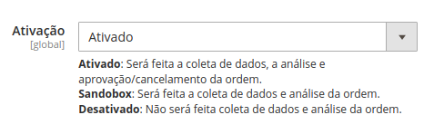
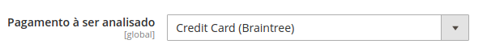
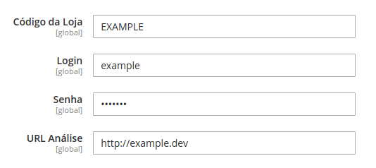

<p align="center">
  <a href="" rel="noopener">
 </a>
</p>

<h3 align="center">Sentynela - Integração Magento 2</h3>

<div align="center">

[]()

</div>

---

<p align="center"> Plugin para integração do Sentynela com o framework de e-commerce Magento 2
    <br> 
</p>

## 📝 Sumário

- [Sobre](#sobre)
- [Pré Requisitos](#prerequisito)
- [Instalando](#instalando)
- [Configurando](#configurando)

## 📖 Sobre <a name = "sobre"></a>

Plugin para integração do Sentynela com o framework de e-commerce Magento 2, possuindo análise de compras e rastreamento de navegação do usuário.

### Atençã! Para utilização do Plugin, é necessário ter Login e Código de Identificação cadastrado com o Sentynela.

## ✔️ Pré Requisitos <a name = "prerequisito"></a>

Desenvolvido sob o Magento 2 v2.3.6

```
PHP 7.3
MySQL 5.7
Magento 2.3.6
```

## 👨🏻‍💻 Instalando/Iniciando <a name = "instalando"></a>

Para instalação do Plugin


- Após fazer o download do .zip, extrair para a pasta app/code (dentro da pasta raíz do Magento).
- Executar o comando:

```
php bin/magento setup:upgrade
```

## ⚙️ Configurando <a name = "configurando"></a>

Para configuração do Plugin, deve ser acessado o menu Stores > Configuration > Sentynela e preencher as abas:

- Geral: configuração de ativação do Plugin, conforme o hint.

<p align="center">
  </a>
</P>

- Endereço: configuração de endereços, para relacionar a configuração de endereços do Magento ao Sentynela.

<p align="center">
  </a>
</P>

- Pagamento: configuração de pagamento, onde será informado o formato de pagamento que será analisado pelo Sentynela.

<p align="center">
  </a>
</P>

- Identificação: configuração de dados de identificação, onde será informadas suas credenciais fornecidas pelo Sentynela. Sem estas informações, mesmo com o Plugin ativado, ele não funcionará e ocasionará erro na sua plataforma.

<p align="center">
  </a>
</P>
